# `/bitfab:setup` Skill Flow

Visual reference for the phases of the Bitfab setup skill (`skills/setup/SKILL.md`).
Edit the Mermaid block below to keep this in sync with the skill.

## Full flow

```mermaid
flowchart TD
    Start([User invokes /bitfab:setup mode]) --> ModeCheck{Mode}
    ModeCheck -->|wizard| P0
    ModeCheck -->|login| L1
    ModeCheck -->|instrument| I1
    ModeCheck -->|modify| M1
    ModeCheck -->|replay| R1
    ModeCheck -->|explain| X1
    ModeCheck -->|inspect| N1

    %% ============ PREAMBLE ============
    P0["0. Preamble<br/>render CODE→TRACES→DATASETS→IMPROVE block verbatim<br/>no AskUserQuestion, no confirmation"] --> L1

    %% ============ LOGIN PHASE ============
    subgraph LoginPhase["LOGIN PHASE"]
        direction TB
        L1["1. Run status check<br/>node status.js"] --> LAuth{Authenticated?}
        LAuth -- No --> LRun["Run login script<br/>node login.js — opens OAuth in browser"]
        LAuth -- Yes --> LKey["2. mcp: get_bitfab_api_key<br/>NEVER print full key"]
        LRun --> LKey
        LKey --> LConsent["3. Ask session log consent<br/>(first login only)<br/>read ~/.config/bitfab/config.json<br/>AskUserQuestion if sessionLogConsent==null<br/>persist via node -e"]
    end

    LConsent --> LStop{login mode only?}
    LStop -- Yes --> CleanupClose
    LStop -- No --> I1

    %% ============ INSTRUMENT PHASE ============
    subgraph InstrPhase["INSTRUMENT PHASE"]
        direction TB
        I1["1. Detect language + frameworks<br/>identify apps vs libraries<br/>flag LangGraph/LangChain, OpenAI Agents,<br/>Claude Agent SDK, BAML imports"] --> I2["2. Search for existing SDK usage<br/>per app dir in monorepos"]
        I2 --> ISDK{Existing<br/>SDK usage?}
        ISDK -- Yes --> IAskMore[/"AskUserQuestion:<br/>• Search more workflows<br/>• Modify existing trace setup<br/>• Continue to Replay"/]
        IAskMore -- Continue --> R1
        IAskMore -- Modify --> M1
        IAskMore -- Search more --> I345
        ISDK -- No --> I345

        I345["3-5. API key, install SDK,<br/>set BITFAB_API_KEY,<br/>fetch /reference/&lt;lang&gt; + /frameworks/&lt;detected&gt;<br/>(then /&lt;lang&gt;-sdk if needed)"] --> I6["6. Choose root span =<br/>★ outer workflow function ★<br/>NEVER the LLM/agent SDK call itself"]
        I6 --> I7["7. Read codebase<br/>find ALL AI workflows + work<br/>above / alongside / below SDK calls"]
        I7 --> I8["8. Present numbered list:<br/>trace boundary, end-to-end scope,<br/>why valuable<br/>★ Pick exactly ONE workflow ★<br/>NEVER multiple, NEVER all"]
        I8 --> I8Serial{"Inputs serializable<br/>by SDK tracing layer?"}
        I8Serial -- "No (live runtime objects)" --> I8Resolve[/"AskUserQuestion in step 8 entry:<br/>(a) move boundary inward<br/>(b) refactor"/]
        I8Resolve -- "(b) refactor" --> I8RefactorPlan[/"Refactor confirmation:<br/>plan labeled visibility or structural<br/>(source, extraction, trace wrap, call sites)<br/>AskUserQuestion: Apply / Cancel"/]
        I8RefactorPlan -- Cancel --> I8Resolve
        I8RefactorPlan -- Apply --> I9
        I8Resolve -- "(a) move inward" --> I9
        I8Serial -- Yes --> I9["9. Read signatures the plan references<br/>skip leaves whose shape isn't in the plan"]
        I9 --> I10Build["10a. Build trace plan under<br/>★ PURELY ADDITIVE ★ constraint<br/>★ Processor SDKs: extend beyond ★<br/>(hybrid manual + auto) by default"]
        I10Build --> IAdd{Requires<br/>behavior change?}
        IAdd -- Yes --> IRestructure["Restructure the TREE:<br/>siblings, separate cycles,<br/>or flatter shape"]
        IRestructure --> I10Build
        IAdd -- No --> I10Post["10b. mcp: create_trace_plan<br/>build TracePlanTree (rootId + nodes),<br/>capturedNodeIds = recommendation,<br/>pre-populate samples per node"]
        I10Post --> I10Open["Bash: node dist/commands/openTracePlan.js &lt;planId&gt;<br/>opens browser via loopback + ticket race;<br/>blocks (up to 30 min) until user confirms/cancels;<br/>poll the live exec session per Blocking-process rule"]
        I10Open --> IExit{JSONL on exit?}
        IExit -- "event: cancelled" --> ICancelInstr["Stop, redirect"]
        IExit -- "non-zero exit / timeout" --> ICancelInstr
        IExit -- "event: confirmed" --> I10Get["mcp: get_trace_plan(planId from JSONL)<br/>read authoritative capturedNodeIds<br/>(planId may differ from original if<br/>mid-session create_trace_plan ran)"]
        I10Get --> I11Split{{"11. ★ PARALLEL GENERATION ★<br/>single message: main-agent Edits (11a) +<br/>Agent() subagent call (11b)<br/>subagent overlaps token generation,<br/>not just file writes<br/>(use browser-confirmed capturedNodeIds)"}}
        I11Split --> I11Instr["11a. Instrumentation edits (main agent)<br/>purely additive — no behavior change<br/>batch repetitive edits in parallel;<br/>>10-file fan-outs → separate subagent"]
        I11Split --> I11Replay["11b. Replay pipeline subagent<br/>Agent(subagent_type='general-purpose')<br/>self-contained brief: key, root signature,<br/>import path, existing/target script path,<br/>Replay non-negotiables, SDK #replay URL<br/>(skip entirely for Go-only projects)"]
        I11Instr --> I12
        I11Replay --> I12
        I12["12. Tell user how to run app<br/>AND how to run replay once traces exist<br/>do NOT run yourself"]
        I12 --> I13["★ MANDATORY STOP ★<br/>13. AskUserQuestion"]
        I13 --> INext[/"AskUserQuestion (always):<br/>A) Generate traces + Node blocks<br/>on waitForTrace.js until first hit<br/>(or ~10min timeout)<br/>B) Instrument next workflow<br/>C) Other workflow<br/>D) Done"/]
        INext -- A --> IAPoll["A. Present script / let user run it<br/>Bash: node dist/commands/waitForTrace.js<br/>(polls every 10s inside Node, zero agent tokens)<br/>parse final JSON line: found / timeout / interrupted"]
        IAPoll --> I8
        INext -- B --> I8
        INext -- C --> I8
        INext -- D --> IStop
        ICancelInstr --> CleanupClose
    end

    IStop{instrument mode only?} -- Yes --> CleanupClose
    IStop -- No --> R1

    %% ============ MODIFY PHASE ============
    subgraph ModifyPhase["MODIFY PHASE"]
        direction TB
        M1["1. Gather existing trace functions<br/>grep getFunction / get_function / etc."] --> MExists{Any<br/>existing keys?}
        MExists -- No --> MNone["Tell user to run<br/>/bitfab:setup instrument"]
        MExists -- Yes --> M2["2. ★ Pick exactly ONE trace function ★<br/>AskUserQuestion with existing keys"]
        M2 --> M3Bootstrap["3a. mcp: get_trace_plan(traceFunctionKey)<br/>fetch the latest confirmed plan for this key —<br/>response includes the full tree as JSON,<br/>used as the 'before' TracePlanTree"]
        M3Bootstrap --> M3Found{Prior plan<br/>found?}
        M3Found -- Yes --> M4Build
        M3Found -- "No (first Modify cycle for key)" --> M3Read["3b. Code-reading fallback:<br/>read instrumented files →<br/>'before' TracePlanTree<br/>(rootId + nodes, same shape as Instrument 10b)"]
        M3Read --> M4Build["4. Build modified trace plan ('after' tree) under<br/>★ PURELY ADDITIVE ★ constraint<br/>apply user's requested modifications<br/>(if no specific request, after = before —<br/>user will edit in the UI)<br/>reuse surviving node ids; mint new ids for adds<br/>★ Add ~10 callers above + ~10 callees below as<br/>'pure' (uncaptured) context nodes ★"]
        M4Build --> MAdd{Requires<br/>behavior change?}
        MAdd -- Yes --> MInvalid["Modification not implementable additively:<br/>explain which part doesn't fit,<br/>ask user to refine the request<br/>(or split into multiple cycles)"]
        MInvalid --> M4Build
        MAdd -- No --> M5Post["5a. mcp: create_trace_plan<br/>{ tree, capturedNodeIds, traceFunctionKey };<br/>tree includes the surrounding 'pure' context"]
        M5Post --> M5Open["5b. Bash: node dist/commands/openTracePlan.js &lt;planId&gt;<br/>★ The UI is the user's primary surface ★<br/>opens browser via loopback + ticket race;<br/>user can toggle 'pure' nodes into the captured set<br/>or remove existing captures directly in the UI;<br/>blocks (up to 30 min) until user confirms/cancels;<br/>poll the live exec session per Blocking-process rule"]
        M5Open --> MExit{JSONL on exit?}
        MExit -- "event: confirmed" --> M5Get["mcp: get_trace_plan(planId from JSONL)<br/>read authoritative capturedNodeIds;<br/>planId may differ if mid-session iteration;<br/>reconcile edits — drop wraps no longer captured,<br/>add wraps for newly captured nodes"]
        MExit -- "event: cancelled" --> M5Modify[/"AskUserQuestion: 'What would you like to change?'<br/>(answer feeds back into step 4;<br/>re-running openTracePlan.js reuses the Studio tab)"/]
        MExit -- "non-zero exit / timeout" --> M5Fallback[/"Inline fallback AskUserQuestion:<br/>Proceed / Expand / Modifications / Abort entirely"/]
        M5Modify --> M4Build
        M5Fallback -- Abort --> CleanupClose
        M5Fallback -- Modifications --> M4Build
        M5Fallback -- Expand --> M5Fallback
        M5Fallback -- Proceed --> M6
        M5Get --> M6["6. Apply changes — purely additive<br/>removing withSpan wrapper is the only<br/>structural edit allowed; key from step 2<br/>is preserved (no rename); batch edits in parallel"]
        M6 --> MNext[/"7. Tell user how to run app — do NOT run yourself<br/>★ MANDATORY STOP ★ AskUserQuestion:<br/>A) Generate trace<br/>B) Modify another trace function<br/>C) Done"/]
        MNext -- B --> M2
        MNone --> CleanupClose
    end

    MNext -- A --> CleanupClose
    MNext -- C --> CleanupClose

    %% ============ REPLAY PHASE ============
    %% Note: most keys already have pipelines from Instrument step 11b
    %% This phase is a coverage-verification / backfill sweep.
    subgraph ReplayPhase["REPLAY PHASE (verify + backfill)"]
        direction TB
        R1["1. Gather all trace function keys<br/>grep getFunction / get_function / etc.<br/>(most already wired up by step 11b)"] --> R2["2. Search for existing replay scripts<br/>scripts/replay.* and SDK replay imports"]
        R2 --> RCov{Coverage}
        RCov -- "Exists,<br/>all keys covered" --> EndUpToDate["Report up to date"]
        RCov -- "Exists,<br/>missing keys" --> R4
        RCov -- "None exist" --> R4
        R4["4. Create replay script<br/>per language, --limit, --trace-ids,<br/>per-pipeline replay fns importing actual functions<br/>(factory patterns: mock runtime context)<br/>Output contract: emit full ReplayResult as one<br/>JSON block (incl. durationMs, tokens, model)"] --> R5Check{"5. Safety net: legacy function<br/>slipped past step-6 gate<br/>and can't be invoked?"}
        R5Check -- No --> EndDone["Done"]
        R5Check -- Yes --> RAskRefactor[/"AskUserQuestion:<br/>Move boundary inward<br/>/ Refactor pure core (Recommended)<br/>/ Leave as-is (document)"/]
        RAskRefactor -- "Move / Refactor" --> R5Reinstrument["Return to step 6<br/>and re-instrument"] --> EndDone
        RAskRefactor -- Leave --> R5Document["Add infra header comment,<br/>flag that script will rot"] --> EndDone
        EndUpToDate --> CleanupClose
        EndDone --> CleanupClose
    end

    %% ============ EXPLAIN PHASE (read-only) ============
    subgraph ExplainPhase["EXPLAIN PHASE (read-only)"]
        direction TB
        X1["1. Render overview verbatim<br/>CODE→TRACES→DATASETS→IMPROVE + primitives<br/>+ what each mode does<br/>no auth, no code scan, no Studio"]
    end
    X1 --> CleanupClose

    %% ============ INSPECT PHASE (diagnostic + optional fix) ============
    subgraph InspectPhase["INSPECT PHASE (diagnostic + optional fix)"]
        direction TB
        N1["1. Status check<br/>node status.js — auth + connection + plugin version"] --> N2["2. Find what's instrumented here<br/>grep SDK patterns; SDK installed?<br/>BITFAB_API_KEY set? shim?"]
        N2 --> N3["3. Check traces arriving<br/>mcp: list_trace_functions + search_traces<br/>mark ✅ / ⚠️ / ❓ per key"]
        N3 --> N4["4. Check freshness<br/>node update.js sdk → bitfab-sdk-status;<br/>plugin version; glob scripts/replay.* coverage"]
        N4 --> N5["5. Report diagnosis<br/>auth, plugin, SDK, instrumented, replay, arrival"]
        N5 --> N6[/"6. AskUserQuestion: Apply fixes?<br/>(skipped when nothing is stale)"/]
        N6 -- "Just report / nothing stale" --> CleanupClose
        N6 -- "Review & apply" --> N7["7. Apply fixes ONE AT A TIME (confirm each)<br/>plugin / SDK per workspace / rename (preview sites);<br/>setup replay refreshes scripts"]
        N7 --> CleanupClose
    end
    class N6 question

    %% ============ CLEANUP PHASE ============
    subgraph CleanupPhase["CLEANUP PHASE"]
        direction TB
        CleanupClose["Cleanup: close Studio<br/>(no-op if no session was opened)"]
    end

    CleanupClose --> EndFinal([Done])

    %% Styling
    classDef terminal fill:#dcfce7,stroke:#166534,color:#000
    classDef question fill:#fae8ff,stroke:#86198f,color:#000
    classDef constraint fill:#fee2e2,stroke:#b91c1c,color:#000
    classDef cleanup fill:#f0f9ff,stroke:#0369a1,color:#000

    class EndFinal terminal
    class CleanupClose cleanup
    class IAskMore,INext,RAskRefactor,I8Resolve,I8RefactorPlan,M5Fallback,M5Modify,MNext,I10Ask question
    class I8,I10Build,IRestructure,I11Split,I11Instr,I11Replay,M2,M4Build,MInvalid,M6 constraint
```

## Key invariants the diagram enforces

0. **Preamble runs once, only in `wizard` mode.** The explanation block (CODE → TRACES → DATASETS → IMPROVE, primitives, phase summary) renders verbatim at the start of `/bitfab:setup` / `/bitfab:setup wizard`, then flows directly into Login. No confirmation step, no marker file — sub-modes (`explain`, `login`, `instrument`, `inspect`, `replay`) skip it entirely because the user has already chosen a phase.

1. **One workflow per Instrument cycle.** Step 8 takes exactly one workflow. The "next workflow" loop from step 13 always returns to step 8 — never to a parallel branch. This means one trace function, one trace plan, one set of code changes per cycle.

1a. **Pre-existing SDK shims must be audited before new instrumentation.** Step 2 (`search-existing`) lists trace function keys, then checks whether the SDK is reached through a project-local shim (a wrapper file that re-exports `withSpan` / `@span` / `bitfab_span` / `getCurrentTrace` with custom init, often `lib/bitfab.*` or named after a predecessor SDK like `lib/simforge.*`). When a shim exists, it must (a) construct the SDK client at module load synchronously (never lazily inside the wrapped function), and (b) hand off to the SDK call synchronously, with no `await` between the user's entry to the shim and `client.withSpan(...)` / `@bitfab.span(...)`. Lazy or async client init breaks the SDK's nesting context (TypeScript `AsyncLocalStorage`, Python `contextvars`) under any parallel fan-out (`Promise.all`, `Promise.allSettled`, `asyncio.gather`, parallel workers), turning every nested span into a top-level trace. The shim must be fixed before any new instrumentation is added — instrumenting on top of a broken shim produces flat traces that look fine in single-call tests and fragment under load.

2. **Trace boundary = outer workflow, not the SDK/agent call.** The root must be re-invokable by the replay harness as a plain lambda with serialized inputs — so it must own its state setup, not consume a pre-built framework/stateful object (compiled graphs, configured SDK clients, DB sessions). Step 6 fixes the root as the outer workflow function (API handler, message processor, job runner, pipeline coordinator) that builds the framework + invokes it + processes the output. The agent SDK's `run()` / `invoke()` is never the root when there's a clear caller above it. Step 7 explicitly looks for work above / alongside / below any agent or SDK call so step 8's scope description and step 10's trace plan reflect end-to-end coverage, not just SDK internals.

3. **Trace processor SDKs default to hybrid plans.** When the SDK registers a processor (OpenAI Agents SDK, etc.), step 10a defaults to a hybrid plan: manual `●` spans wrap the workflow, the SDK call appears as one `(agent)` child whose grandchildren are `[auto]` lines, and other manual spans capture work above/alongside/below the SDK call. The bare auto-only plan is reserved for the rare case where the workflow truly is just the SDK call.

3a. **One flow = one trace function key.** Step 10a forbids a second key that covers the same flow. When an outer `@bitfab.span` / `withSpan` / `bitfab_span` and a framework handler (LangGraph callback, Claude Agent SDK handler) wrap the same work, they must share the same key. Separate trace functions are for reusable sub-components with their own standalone root.

4. **Purely additive instrumentation.** Step 10a builds the trace plan under the constraint that the tree must be implementable without behavior changes. If a candidate tree requires `await`-ing a stream that wasn't awaited, delaying a call, reordering, blocking a callback, or restructuring control flow, the tree is invalid — restructure the *tree* (siblings, separate cycles, flatter shape), not the code.

5. **Trace plan presentation is gated.** The trace plan is never shown until the additive check passes (10a → 10b). Behavior-changing approaches are never offered as options.

5a. **Trace plan confirmation is a browser handoff, the same shape as `login.js` / `startDataset.js`.** Step 10b posts the plan via `create_trace_plan` and then runs `node dist/commands/openTracePlan.js <planId>`. That CLI navigates Studio (via `openStudioTo`) and emits JSONL to stdout: `{"event":"session-ready","sessionId":"..."}` once the session is established, then blocks until the user clicks **Confirm** or **Chat about this**. The script auto-tracks new plans via `tracePlan:created` agent events: when the server creates a plan, it publishes a Redis SSE event that the browser's `TracePlanView` receives; the browser relays a `tracePlan:created` agent event (with the new planId) into the session stream and auto-navigates to the new plan. The script updates its `currentPlanId`, so mid-session plan iterations are transparent. The skill polls the live exec session per the Blocking-process rule until the process exits: `{"event":"confirmed","planId":"..."}` proceeds to `get_trace_plan` (using the `planId` from the JSONL, which may differ from the original) for the authoritative `capturedNodeIds`; `{"event":"cancelled","planId":"..."}` or non-zero / timeout exits the cycle without writing instrumentation. The inline format remains in the skill as a fallback for when the MCP tool errors (offline, MCP unreachable).

5b. **Modify uses the trace plan UI as the primary modification surface.** Modify step 5a posts the modified plan (the `after` `TracePlanTree` built in step 4, which includes ~10 surrounding callers above the root and ~10 surrounding callees below each leaf as `pure` (uncaptured) context nodes) via `create_trace_plan` with the `traceFunctionKey` field set, and step 5b runs `openTracePlan.js` with the same JSONL + polling contract as Instrument step 10b. The user can toggle the surrounding `pure` nodes into the captured set or remove existing captures directly in the UI. `{"event":"confirmed","planId":"..."}` flows into `get_trace_plan` (using the `planId` from the JSONL, which may differ from the original if a mid-session `create_trace_plan` triggered a `tracePlan:created` relay) to read the reconciled `capturedNodeIds` and on to step 6 (apply edits). `{"event":"cancelled","planId":"..."}` flows into an AskUserQuestion ("what would you like to change?") whose answer feeds back into step 4; when the loop re-runs `openTracePlan.js` with the new plan, the script reuses the existing Studio browser tab (the active session file survives process exit and `openStudioTo` navigates it). Non-zero / timeout falls back to the inline AskUserQuestion (Proceed / Expand / Modifications / Abort entirely). When the user invokes Modify without naming any specific change, step 4 produces an `after` tree identical to `before` and the UI is the only place modifications happen.

5c. **Modify bootstraps the `before` tree from the prior plan.** Modify step 3a calls `get_trace_plan` with `{ traceFunctionKey }` (no `planId`) to fetch the latest *confirmed* plan for the chosen key. The MCP response includes the full tree as JSON, which becomes the `before` tree directly — no code-reading needed. Step 3b is a fallback for keys with no prior confirmed plan (created outside the skill, or first Modify cycle that predates the `traceFunctionKey` column). The `traceFunctionKey` is persisted on every `create_trace_plan` call (Instrument step 10 + Modify step 6a) so the next Modify cycle can find it.

6. **Skill mode gates.** `login` mode stops after the Login phase. `instrument` mode stops after the Instrument loop completes. `wizard` mode flows through login → instrument → replay (Modify is **not** part of `wizard`). `modify` mode jumps straight to Modify and does not auto-continue to Replay. `replay` mode jumps straight to Replay. `explain` mode renders the read-only overview and ends. `inspect` mode runs the diagnostic, offers to apply fixes, and ends (natural-language "debug my tracing setup" routes here too — it's not a separate mode token). All modes end at the Cleanup phase before the final `Done`. (The skill also exposes `session-logs`, `view`, and `templates` modes, not drawn here.)

7. **Replay coverage is computed before action.** The Replay phase reads the current state first (existing keys + existing scripts), then takes one of three branches: all covered → stop, missing keys → add, none exist → create. No user prompt on any branch.

8. **Replay functions call real code.** Each pipeline's replay function imports and invokes the actual instrumented function — never a stub. Factory-created functions are wrapped by calling the factory with mocks for closure dependencies (stream writers, session objects).

9. **Standalone-invokability is a static check, not a runtime one.** Step 5 reasons from the instrumented function's signature and dependencies to decide if it can be called from the replay script — it never executes the script to verify. If the function takes HTTP req/res objects, reads middleware-injected state, or needs a live server, it's not standalone-invokable. Refactor (extract a pure core and move the trace wrap to it) is the recommended resolution; the "leave as-is" path requires a header comment flagging the infra dependency.

10. **Serializable inputs are a trace-boundary constraint, not a replay concern.** Step 6 forbids wrapping any function whose inputs can't be serialized by the SDK's language-native tracing layer (TS/JSON, Python/JSON via Pydantic, Ruby/`to_json`, Go/`json.Marshal`). Live browser objects, HTTP req/res, stream writers, sockets, middleware-carrying request contexts, open file handles, live DB connections, and **live SDK client instances passed as arguments** (LLM clients, configured agents, HTTP agents whose class internals carry circular references) all fail this test. Module-level dependencies don't count *when accessed via module scope or closure*; the same client passed *as an argument* is captured as input and will fail (and badly-failing inputs can drop the entire span, not just garble the input field). Step 8 surfaces the violation as part of the workflow entry and requires the user to pick **hoist client to module scope**, **move boundary inward**, or **refactor upfront** before step 9. The Replay-phase step 5 is only a safety net; the primary gate is at instrument time, not after code has been written.

11. **Refactors require a plan + second confirmation, and are labeled by flavor.** When the user picks "refactor" (or any option that modifies existing functions/call sites), the skill must first present a refactor plan labeled as **visibility** (extract + export, logic unchanged — most cases) or **structural** (new pure-core fn with serializable inputs — rare overall, common for realtime/streaming/browser apps). The plan lists source fn, extracted fn signature, trace wrap location, every rewritten call site. Then AskUserQuestion (`Apply` / `Cancel`) before touching code; Cancel returns to the originating AskUserQuestion. Does NOT apply to step 11a's purely-additive instrumentation or step 11b's new-file replay pipeline writes — only to paths that modify existing code.

12. **Replay is unconditional in `wizard` mode, and non-interactive once entered.** After Instrument step 13 option D in `wizard` mode, Replay always runs as a coverage-verification/backfill sweep. Replay does not depend on traces existing — it reads trace function keys from code. Once inside Replay, there is no "Skip" branch: missing scripts get added and absent scripts get created without asking. The only Replay terminal state besides completion is "scripts exist and cover all keys, stop."

13. **Instrumentation and replay pipeline are generated concurrently via subagent delegation.** Step 11 fans out into 11a (main agent: instrumentation edits) and 11b (subagent: replay pipeline for this cycle's trace function key), dispatched in a single message. The subagent — spawned via `Agent(subagent_type="general-purpose")` with a self-contained brief (key, root signature, import path, existing/target replay script path, Replay non-negotiables, SDK `#replay` URL) — generates its code in parallel with the main agent's. This is the key shift: parallel `Edit` calls alone only overlap millisecond file writes, whereas a subagent overlaps the seconds-to-minutes of token generation. The replay subagent is skipped for Go-only projects (Go does not support replay). The trace plan's `Files changed:` list covers both halves, including the new/edited replay script path. The Replay phase therefore typically runs as a sweep that confirms everything is already wired up; it still exists to catch pre-existing trace function keys (added outside the skill or before this step was parallelized) and to verify Replay Output Contract compliance, including that every script emits the full `ReplayResult` (with per-item `durationMs`/`duration_ms`, `tokens`, `model`) as a single JSON block.

14. **Step 13 is a mandatory AskUserQuestion stop. Option A delegates the wait to `dist/commands/waitForTrace.js`** — a Node CLI (shared via `bitfab-plugin-lib`) that polls Bitfab every 10s until the first trace lands or a ~10 min timeout fires, then prints one JSON line (`found` / `timeout` / `interrupted`) and exits. The agent invokes it with a single long-timeout `Bash` call, so no agent tokens are burned during the wait — same pattern as `login.js` / `startDataset.js`. The skill never silently transitions from Instrument to Replay; only option D exits the loop. Replay does not check for traces — scripts are created from trace function keys in code.

15. **One trace function per Modify cycle.** Modify step 2 picks exactly one trace function. Batching multiple trace functions is forbidden — the user loops via the Modify step 7 menu if they want more.

16. **Purely additive modifications.** Modify step 4 enforces the same additive constraint as Instrument step 10a: if a requested modification would require a behavior change (awaiting a stream that wasn't awaited, delaying a call, reordering, blocking a callback, restructuring control flow), it is rejected and the user is asked to refine the request (or split into multiple cycles). Removing a `withSpan`/`@span` wrapper is the only structural edit allowed, and only when the underlying call stays intact.

17. **Trace plan UI is gated on the same additive check.** Modify step 5 (post + open the plan in the UI) is only reached after step 4 proves the modification is additive; the UI is never shown alongside a behavior-changing option.

18. **Trace function key is preserved across Modify cycles.** Modify never renames the key — the key from step 2 carries through step 5's `create_trace_plan` and step 6's edits unchanged. Historical traces continue to aggregate under the same key, and the next Modify cycle bootstraps from the persisted plan via `get_trace_plan({ traceFunctionKey })`.

19. **Universal Studio cleanup.** Every terminal exit routes through the `cleanup/close-studio` step. If a Studio session was opened (any command that emitted `session-ready`), the step closes it via `closeStudio.js <sessionId>`. If no session was opened, it is a no-op. This is enforced structurally by the flow (every phase's terminal step points to `cleanup/close-studio`), not by a behavioral instruction the agent must remember — the `explain` and `inspect` modes route here too even though they never open Studio, exactly as `session-logs` does.

20. **`explain` is purely informational.** `explain` mode renders the product/mode overview verbatim (the same CODE → TRACES → DATASETS → IMPROVE block as the preamble, plus a one-line description of each mode) and then stops. It never authenticates, scans the codebase, opens Studio, or asks a question. It exists so a user can ask "what is Bitfab" / "explain Bitfab" without starting setup.

21. **`inspect` is a setup diagnostic + one-shot remediator, distinct from `assistant`.** (Natural-language "debug my tracing setup" / "debug-setup" routes to `inspect` — scoped to setup health, vs `assistant`'s output-quality "debug my agent". There is no separate `debug-setup` mode token.) `inspect` reports trace *delivery and setup health*: auth/connection (`status`, including the plugin-version line), what's instrumented in this repo (grep SDK patterns; SDK installed?; `BITFAB_API_KEY` set?), plugin/SDK freshness (reuses the `update.js` `<bitfab-sdk-status>` check — the canonical version logic lives in `sdkUpdates.ts`, not in `assistant`), replay-script coverage (Glob/Grep, the same check `assistant` runs in its Phase 2), and whether traces are actually arriving (`list_trace_functions` + `search_traces`, marking each key ✅ arriving / ⚠️ instrumented-but-no-traces / ❓ in-org-but-not-in-repo). It then **offers to apply the fixes, each confirmed individually** (one decision per question — nothing is applied blanket): update the plugin + SDK (the same per-workspace commands as `bitfab:update`) and refresh replay scripts (delegates to `setup replay`). The legacy-package rename previews the `from "bitfab"` / `require("bitfab")` sites it would rewrite before touching code. It opens no Studio. Improving the *quality* of a traced function's outputs (pass rates, failing cases) stays in `bitfab:assistant`.

## Legend

| Shape | Meaning |
|---|---|
| Rectangle | Action / step |
| Hexagon | Parallel fan-out — the children run concurrently |
| Diamond | Internal decision (Claude decides based on state) |
| Parallelogram | AskUserQuestion (user decides) |
| Stadium (rounded) | Terminal — flow stops |
| Red fill | Hard constraint — violating this is a bug |
| Purple fill | User interaction point |
| Green fill | Successful exit |
| Blue fill | Cleanup step |

## How to update

When `skills/setup/SKILL.md` changes (steps added, removed, reordered, or branching changes), update the Mermaid block above and re-render to verify. The diagram and the skill must agree — they document the same flow.

Same edits should be mirrored to `bitfab-cursor-plugin/skills/bitfab-setup/SKILL.md` and `bitfab-codex-plugin/skills/setup/SKILL.md` per the CLAUDE.md plugin sync rule. The codex skill carries platform-specific extras (`BITFAB_PLUGIN_DIR` resolution, ticket-channel + browser-launch-failure rules, Blocking-process polling rule) that stay codex-only.
